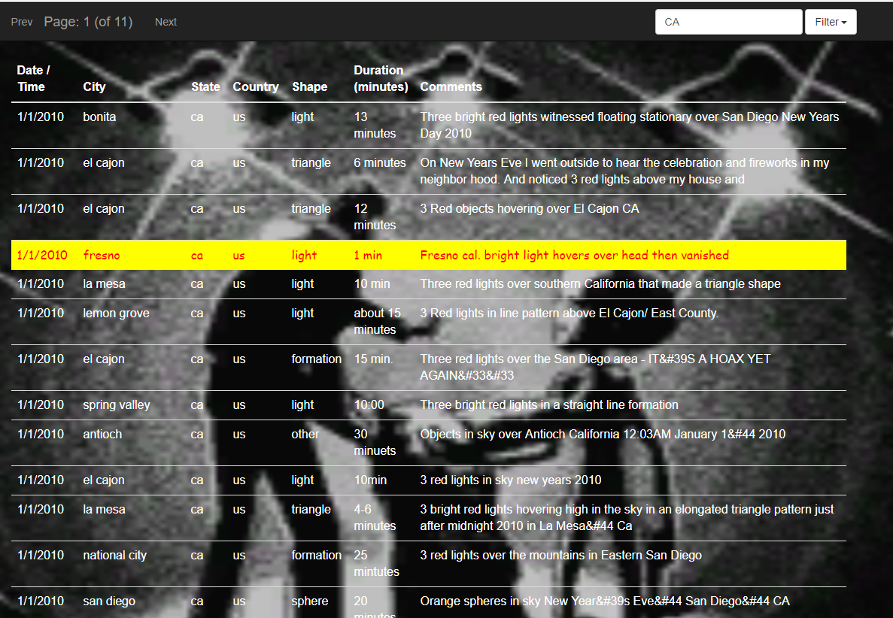

# Javascript HTML Population

## Goal

Use Javascript to populate an HTML page with data.

The data in the example is about UFO sightings, so I was inspired to theme it like a 1990s Geocities UFO page.  Everything that looks bad is intentionally and painstakingly so.

[See it in action](https://totopi.github.io/Javascript-HTML-Population/)
